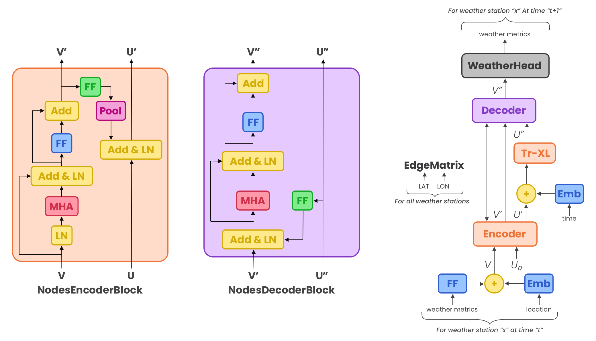

# Climate Modelling using Heirarchical Transformer

<!-- This is code for paper with the same title [here](#), first whitepaper by [KS2 Projects](#) -->

The idea is very simple, there are two parts to climate:
1. Local Effects: Effects that are caused due to planetary behaviour
2. Celestial Effects: Effects that are caused due to celestial bodies like changes in solar radiations

We only consider the Local effects for now since there is not much work on this. The local effects can be considered like message passing in a graph. Each node has some attributes of it's own and the observations at one place then gets "transmitted/passed" to different location like ["El Niño"](https://en.wikipedia.org/wiki/El_Ni%C3%B1o).


## [Data](old/data.md)

Instructions for downloading:
```
python prep_data.py -d
# move all the downloaded files to args.folder manually, someone can probably write a better method here
python prep_data.py -x # unzips all the files
python prep_data.py -c # compiles the exhaustive dataset
```

After this we get a massive uncompressed dataset, next step is to convert this to an HDF5 dataset. For this read `prepare_hdf5` notebook.

## Repo Structure
The repo is super simple there are 6 main files:

* [prep_data.py](./prep_data.py): This file contains methods to create the dataset from scratch. When all the instructions are run, the final output is a HDF5 dump that contains the training/testing data. **This is not ready yet.**
* [data.py](./data.py): This file contains the `WeatherDataset` object that is used for training the model. It also has `DummyDataset` used to demonstrate that my model can learn something.
* [model.py](model.py): This file has `HeirarchicalTransformer` model, most of the code is from [`transformers`](https://github.com/huggingface/transformers) however where and when needed a local copy of code has been created. This allows for my modifications like runtime building of attention mask in code.
* [optimizer.py](optimizer.py): This file has `AdaBelief` optimizer since it was not available in pytorch locally at the time of writing repo. This file is usually not needed but it's okay for now.
* [trainer.py](trainer.py): This file has `Trainer` object that manages the training of models.
* [run.py](run.py): This is training script called by user. To get all the args run `python3 run.py --help`.

## Model
Model diagram is given below:



It has encoder (`NodeEncoderBlock`), processor (`GlobalTransfoXLModeller`) and decoder (`NodeDecoderBlock`) architecture.

## Credits

> "Science is built by standing on the shoulders of giants"

I merely joined some code to get this output. The real work was done by all those that came before me. Model is written using [`huggingface transformers`](https://github.com/huggingface/transformers). The repo structure is similar to one used in [`minGPT`](https://github.com/karpathy/minGPT) by Karpathy.
